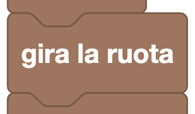

# Block Code

You can use [Blockly](https://developers.google.com/blockly) to create problems that require a block code answer. The problem text should contain a `Blockly` component:

```jsx
import customBlocks from "./custom.blocks.yaml";
import initialBlocks from "./initial-blocks.json";
import testcases from "./testcases.py";
import visualizer from "./visualizer";

Problem text...

<Blockly
  customBlocks={customBlocks}
  initialBlocks={initialBlocks}
  testcases={testcases}
  visualizer={visualizer}
/>
```

The `Blockly` component must have the following properties:

  - `customBlocks`: the [custom blocks](#custom-blocks) for the problem.
  - `initialBlocks`: a JSON file containing the blocks and variables initially present in the problem's block editor:
    ```json
    {
      "blocks": {
        "languageVersion": 0,
        "blocks": [...]
      },
      "variables": [...]
    }
    ```
    This can be generated manually, but it's more convenient to generate it using the "Debug" button during problem development.
  - `testcases`: an array of objects containing the test case variables. It can be imported from a Python or JSON file or defined directly in JavaScript within the problem file.
    ```json
    [
      { "N": 4, "A": [1, 2, 3, 4] },
      { "N": 5, "A": [5, 4, 3, 2, 1] },
      ...
    ]
    ```
  - `visualizer`: a React component that visualizes the test case state:
    ```jsx
    function Visualizer({ variables, state }) {
      ...
    }
    ```
    The function receives user-defined variables and the test case state as parameters. Initially, the state corresponds to the test case variables and is updated during block code execution.

## Custom Blocks

There are two types of blocks: *statement* blocks and *output* blocks.

  - *statements* are blocks that perform an action without returning a value. They can be connected to another block above or below:

  

  - *outputs* are blocks that return a value and can be used as parameters for other blocks:

  

::: warning ATTENTION
Blocks must be defined within a YAML file with a `.blocks.yaml` extension.
:::

Each block has the following fields:
  - `type`: block ID.
  - `message0`: text shown in the block. It must contain `%1`, `%2`, ... placeholders for block arguments.
  - `args0`: list of [block arguments](#block-arguments).
  - `colour`: [block color](https://developers.google.com/blockly/guides/create-custom-blocks/block-colour#colour_formats). It can be a number between 0 and 360 or an RGB string.
  - `tooltip`: text that appears when hovering over the block with the mouse.
  - `maxInstances`: maximum number of allowed blocks of this type. If not specified, the number of blocks is unlimited.
  - `js`: a string containing the JavaScript code to execute when the block is run. The code can contain `%1`, `%2`, ... placeholders for arguments which will be replaced with the argument code. In output blocks, the code must be a single expression that returns a value.
    ::: warning ATTENTION
    The code must conform to ES5 JavaScript specifications, so most modern functionalities are not supported.
    :::

*Statements* can have the following additional fields:
  - `previousStatement`: `null` if the block can be connected to another block above.
  - `nextStatement`: `null` if the block can be connected to another block below.

*Outputs* must have the following additional field:
  - `output`: type of block output: `Number`, `String`, `Array`, or `Boolean`.

::: details Example of a statement block

```yaml
- type: turn_wheel
  message0: turn the wheel
  previousStatement: null
  nextStatement: null
  colour: 20
  tooltip: Turn the wheel by one section
  js: state.angle = (state.angle + 45) % 360;
```

:::

::: details Example of an output block

```yaml
- type: minimum
  message0: minimum between %1 and %2
  args0:
    - type: input_value
      check: Number
    - type: input_value
      check: Number
  output: Number
  colour: 20
  tooltip: the minimum value between x and y
  js: Math.min(%1, %2)
```

:::

### Block Arguments

An argument is represented by an object with a `type` field specifying the argument type, and additional fields depending on the argument type.

QuizMS supports two types of arguments:

  - `field_dropdown`: a dropdown menu with predefined values. The `options` field must contain the list of dropdown menu options, each option is represented by an array of two elements: the displayed text and the generated JavaScript code.

    ```yaml
    args0:
      - type: field_dropdown
        options:
          - [addition, SUM]
          - [difference, DIFF]
          - [product, PROD]
          - [division, DIV]
    ```

  - `input_value`: an output block that can be connected to this block.

    The `check` field specifies the type of block that can be used: `Number`, `String`, `Array`, or `Boolean`. QuizMS also adds the `Integer` type which extends the `Number` type by validating during execution that the value is an integer.

    You can also specify `min` and `max` fields to validate during execution that the value is within the two extremes; the fields must contain JavaScript code.

    ```yaml
    args0:
      - type: input_value
        check: Integer
        min: "1"
        max: state.N
    ```
